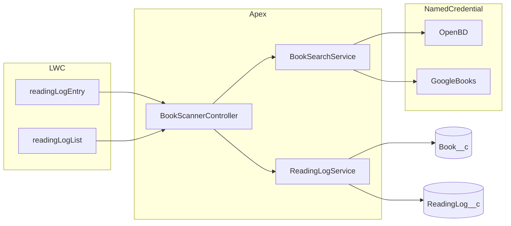
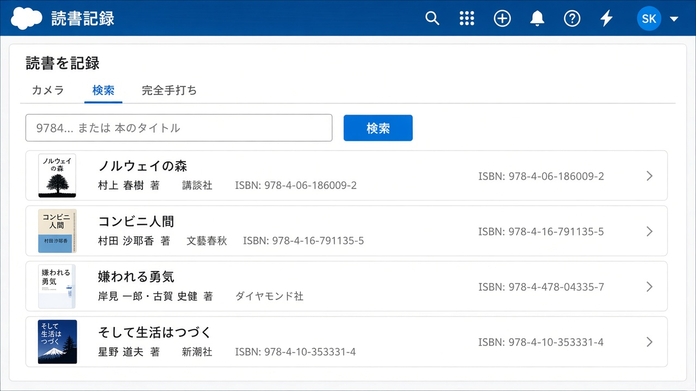
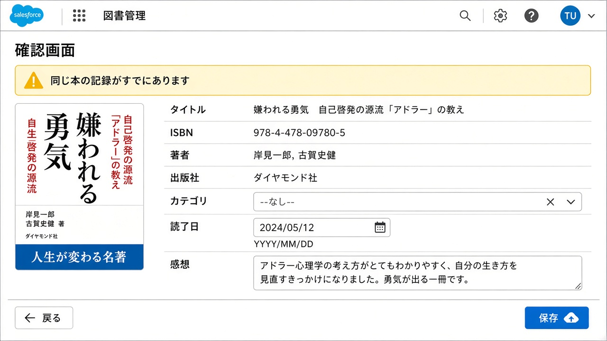
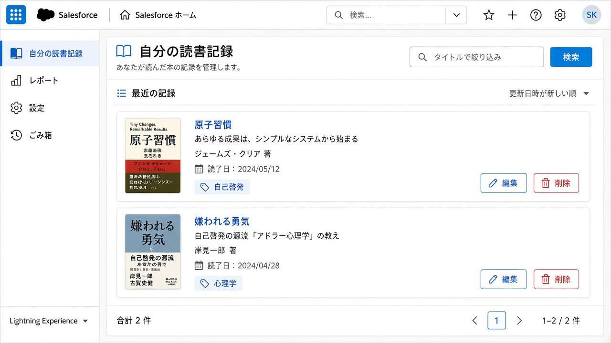
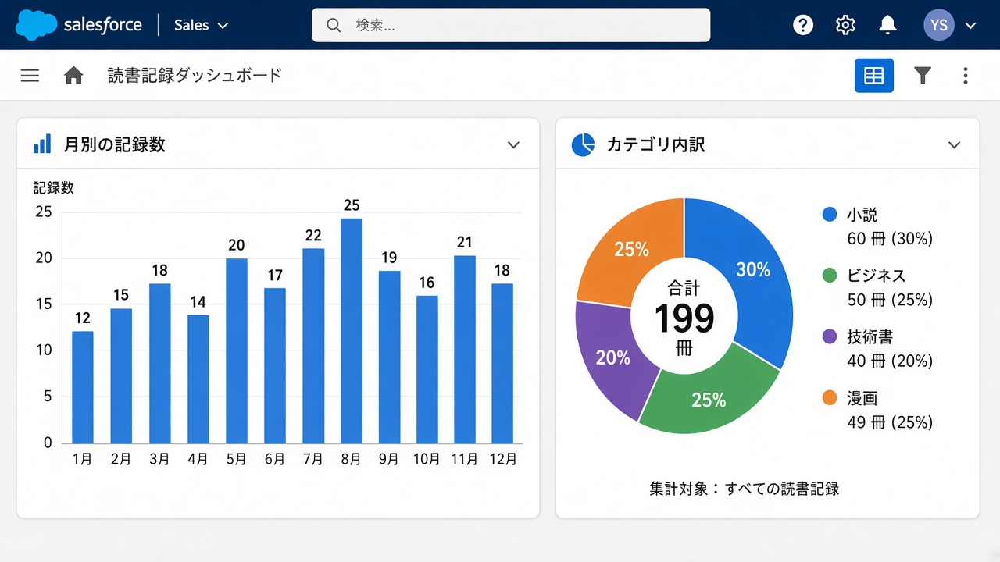

# 読書記録アプリ（Salesforce）

読了した本を記録し、月別・カテゴリ別に可視化する Lightning アプリ。  
自分で使う実アプリであると同時に、Salesforce の包括的な開発スキル（要件定義、関係設計、セキュリティ、外部連携、ソース駆動開発）を示すポートフォリオである。

設計の正本は [docs/requirements.md](docs/requirements.md)。当初メモは [docs/memo.md](docs/memo.md)。

## アプリ概要

3 つの入力経路で書誌を集め、確認してから読書記録を保存する。

| 経路 | 動き |
| --- | --- |
| カメラ | Salesforce モバイルアプリのバーコードから ISBN → openBD |
| 検索 | ISBN なら openBD、タイトルなら Google Books の一覧から 1 冊選択 |
| 完全手打ち | API に無い同人誌・古い本 |

データは 2 階層。`Book__c` は書誌マスタ（公開参照）、`ReadingLog__c` は読了記録（非公開）。同じ本の再読は記録を追加する。



### 画面イメージ

検索タブで候補から 1 冊選ぶ。



確認画面。既存記録がある場合は警告する。



自分の記録一覧。編集は標準レコードページ、削除は LWC から。



標準レポートを使ったダッシュボード。



> 上の画像は UI イメージである。デプロイ後に組織で撮った実画面に差し替えると、ポートフォリオの説得力が増す。

## デプロイ手順

前提: Salesforce CLI（`sf`）、このリポジトリ、Developer Edition 組織。

```bash
# 1. 組織にログイン（デフォルト組織にする）
sf org login web --set-default --alias reading-de

# 2. ソースをデプロイ
sf project deploy start --ignore-conflicts

# 3. 自分に権限セットを付与
sf org assign permset --name ReadingAppUser
```

### Google Books API キー（タイトル検索）

キーなしでも Google Books は呼べることが多いが、制限が厳しい。推奨:

1. [Google Cloud Console](https://console.cloud.google.com/) で Books API を有効化し、API キーを発行する
2. Salesforce でカスタムメタデータ **API設定** のレコード `Google_Books` を開き、`APIキー` に貼る

Named Credential `OpenBD` と `GoogleBooks` はソースに含まれ、認証は Anonymous である。

### アプリの開き方

1. アプリランチャー → **読書記録**
2. **読書を記録** タブで登録（PC ではカメラタブは非対応メッセージ）
3. **記録一覧** で自分の記録を確認
4. **ダッシュボード** またはレポートフォルダ「読書記録レポート」で可視化

モバイルでバーコードを使うときは、Salesforce モバイルアプリで同じ Lightning アプリを開く。

### データのバックアップと復元

```bash
# エクスポート（CSV）
bash scripts/export-reading-data.sh

# デモデータの投入（親子 JSON。ISBN サンプルあり）
bash scripts/import-reading-data.sh
```

CSV から戻す場合は **本を先に** upsert する（`ISBN__c` が外部 ID）。ISBN の無い手打ち本は外部 ID が空なので、tree import か Id 付き insert が必要。

```bash
sf data upsert bulk --sobject Book__c --external-id ISBN__c --file data/books.csv --wait 10
```

## 使ったスキル（短いまとめ）

| 領域 | このプロジェクトでの実体 |
| --- | --- |
| 要件定義 | QA で輪郭を固め、[docs/requirements.md](docs/requirements.md) に落とした |
| データモデル | マスタ `Book__c` とトランザクション `ReadingLog__c`、Lookup、外部 ID |
| セキュリティ | OWD（公開参照 / 非公開）、権限セット `ReadingAppUser`、`with sharing`、`USER_MODE` |
| 外部連携 | Named Credential、openBD、Google Books、`HttpCalloutMock` |
| LWC | タブ分割、命令的 Apex、モバイル `barcodeScanner`、確認〜一覧 |
| Apex テスト | ISBN 変換、コールアウト、find-or-create、権限なし、共有 |
| 可視化 | カスタムレポートタイプ、レポート、Lightning ダッシュボード |
| ソース駆動 | `sf project deploy start`、権限セット割り当て、CSV/tree でのデータ移行 |

シーケンス図: [docs/design/sequence-isbn-search.md](docs/design/sequence-isbn-search.md) / [sequence-title-search.md](docs/design/sequence-title-search.md) / [sequence-save.md](docs/design/sequence-save.md)

## ローカル構成

```
force-app/main/default/   オブジェクト・LWC・Apex・権限セット・レポート
docs/                     要件・データモデル・セキュリティ・シーケンス
scripts/                  CSV エクスポート / サンプル import
data/sample/              デモ用 JSON
```
