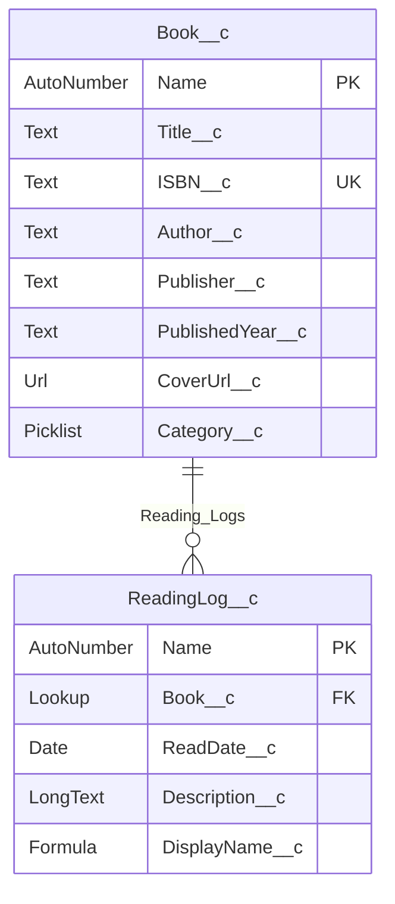

# データモデル

## このフェーズで覚えること

Salesforce では「何度も使い回すマスタ」と「何回も増えるトランザクション」をオブジェクトとして分ける。  
本（書誌）は ISBN があれば世界に 1 冊の定義、読書記録は「いつ読んだか」なので別物である。Lookup は「参照関係」で、親を消すと子どうするかを `deleteConstraint` で決める。

---

## Book__c（本）

書誌マスタ。家族が同じ ISBN を読んだときは **既存レコードを再利用** する（所有者は最初に作った人のままでよい）。

| API 名 | ラベル | 型 | 必須 | 用途 |
| --- | --- | --- | --- | --- |
| Name | 本番号 | 自動採番 `BOOK-{0000}` | はい | 内部識別 |
| Title__c | タイトル | テキスト(255) | はい | 書名 |
| ISBN__c | ISBN | テキスト(13) 外部ID・重複不可 | いいえ | ISBN-13（ハイフンなし）。upsert キー |
| Author__c | 著者 | テキスト(255) | いいえ | API または手入力 |
| Publisher__c | 出版社 | テキスト(255) | いいえ | API または手入力 |
| PublishedYear__c | 出版年 | テキスト(20) | いいえ | `2018` や `2018-04` など API の表記をそのまま |
| CoverUrl__c | 表紙URL | URL | いいえ | openBD / Google Books の画像 URL |
| Category__c | カテゴリ | 選択リスト | いいえ | 小説 / ビジネス / 技術書 / 趣味 / 漫画 / その他 |

ISBN が空の手打ち本は Unique 制約の対象外（Salesforce は null を複数許可する）。

## ReadingLog__c（読書記録）

| API 名 | ラベル | 型 | 必須 | 用途 |
| --- | --- | --- | --- | --- |
| Name | 記録番号 | 自動採番 `LOG-{0000}` | はい | 内部識別 |
| Book__c | 本 | Lookup → Book__c | はい | 関係名 `Reading_Logs`。削除は Restrict（記録がある本は消せない） |
| ReadDate__c | 読了日 | 日付 デフォルト TODAY() | はい | 記録の本体 |
| Description__c | 感想 | ロングテキスト | いいえ | メモ |
| DisplayName__c | 表示名 | 数式（テキスト） | — | `タイトル (読了日)` をリストで見やすくする |

Owner は作成者。OWD 非公開なので、共有ルールを足さない限り本人しか見えない。

## 保存ルール

1. ISBN あり → `ISBN__c` で Book を探す。あれば再利用、なければ insert。
2. ISBN なし → 毎回新しい Book を insert（名寄せしない）。
3. ReadingLog を insert（読了日・感想・Lookup）。
4. 同一 Book に自分の ReadingLog が既にあれば、UI で警告するだけ。保存は拒否しない。

確認画面でタイトルやカテゴリを直した場合:

- 既存 Book を再利用するとき、**自分が所有者なら**書誌項目を更新してよい。他人所有の Book は更新せず Lookup だけ使う（FLS と所有者更新権限の衝突を避ける）。
- 新規 Book なら、確認画面の内容で insert する。
