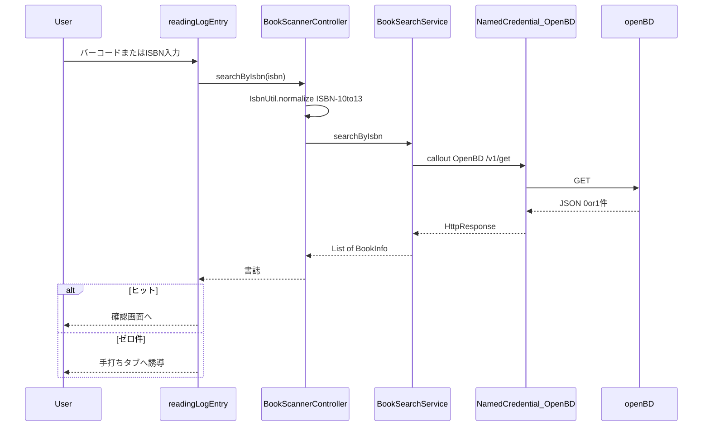

# ISBN 検索シーケンス

カメラまたは検索タブから ISBN を渡したときの流れ。保存はしない。

覚えるポイント: LWC は外部 API を直接呼ばない。Apex + Named Credential 経由にする。

```mermaid
sequenceDiagram
  participant User
  participant LWC as readingLogEntry
  participant Apex as BookScannerController
  participant Svc as BookSearchService
  participant NC as NamedCredential_OpenBD
  participant API as openBD

  User->>LWC: バーコードまたはISBN入力
  LWC->>Apex: searchByIsbn(isbn)
  Apex->>Apex: IsbnUtil.normalize ISBN-10to13
  Apex->>Svc: searchByIsbn
  Svc->>NC: callout OpenBD /v1/get
  NC->>API: GET
  API-->>NC: JSON 0or1件
  NC-->>Svc: HttpResponse
  Svc-->>Apex: List of BookInfo
  Apex-->>LWC: 書誌
  alt ヒット
    LWC-->>User: 確認画面へ
  else ゼロ件
    LWC-->>User: 手打ちタブへ誘導
  end
```
