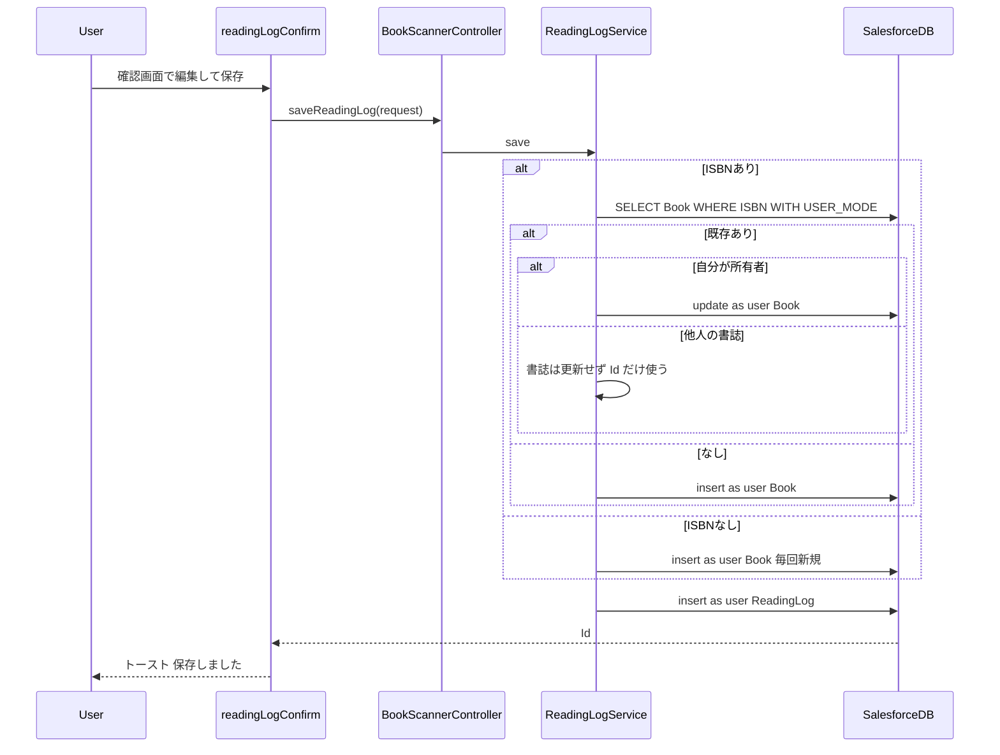

# 保存シーケンス

確認画面の内容で Book を find-or-create し、ReadingLog を insert する。

```mermaid
sequenceDiagram
  participant User
  participant Confirm as readingLogConfirm
  participant Apex as BookScannerController
  participant Svc as ReadingLogService
  participant SF as SalesforceDB

  User->>Confirm: 確認画面で編集して保存
  Confirm->>Apex: saveReadingLog(request)
  Apex->>Svc: save
  alt ISBNあり
    Svc->>SF: SELECT Book WHERE ISBN WITH USER_MODE
    alt 既存あり
      alt 自分が所有者
        Svc->>SF: update as user Book
      else 他人の書誌
        Svc->>Svc: 書誌は更新せず Id だけ使う
      end
    else なし
      Svc->>SF: insert as user Book
    end
  else ISBNなし
    Svc->>SF: insert as user Book 毎回新規
  end
  Svc->>SF: insert as user ReadingLog
  SF-->>Confirm: Id
  Confirm-->>User: トースト 保存しました
```

再読警告は保存の前に `findMyLogsForIsbn` で行う。既存を開くか、このまま追加するかを UI で選ぶ。保存自体は拒否しない。
