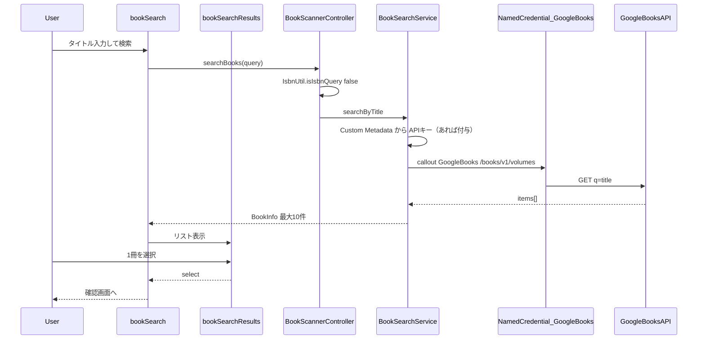

# タイトル検索シーケンス

検索タブに ISBN 以外を入れたときの流れ。複数件から 1 冊選ぶ。

```mermaid
sequenceDiagram
  participant User
  participant Search as bookSearch
  participant Results as bookSearchResults
  participant Apex as BookScannerController
  participant Svc as BookSearchService
  participant NC as NamedCredential_GoogleBooks
  participant API as GoogleBooksAPI

  User->>Search: タイトル入力して検索
  Search->>Apex: searchBooks(query)
  Apex->>Apex: IsbnUtil.isIsbnQuery false
  Apex->>Svc: searchByTitle
  Svc->>Svc: Custom Metadata から APIキー（あれば付与）
  Svc->>NC: callout GoogleBooks /books/v1/volumes
  NC->>API: GET q=title
  API-->>Svc: items[]
  Svc-->>Search: BookInfo 最大10件
  Search->>Results: リスト表示
  User->>Results: 1冊を選択
  Results-->>Search: select
  Search-->>User: 確認画面へ
```

1 件だけヒットした場合は、選択を省略して確認画面へ進む。
