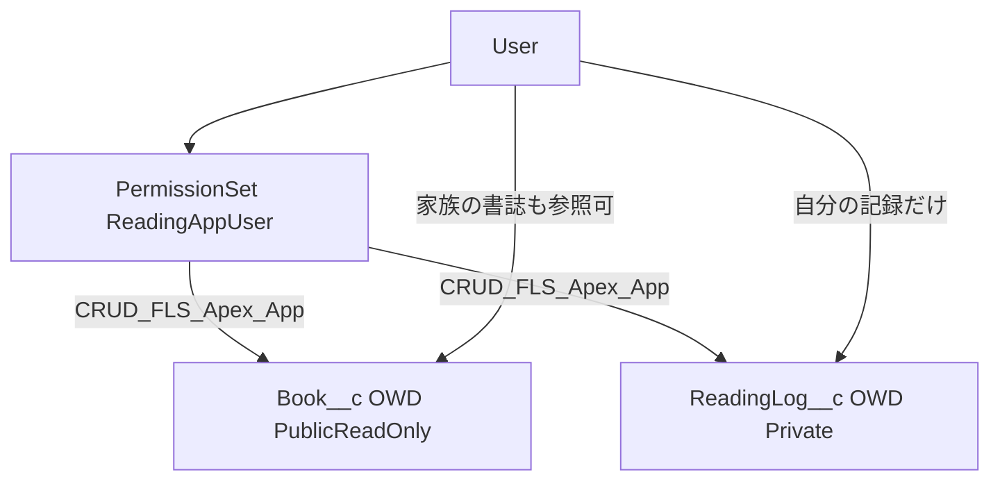

# セキュリティ設計

## このフェーズで覚えること

- **OWD（組織の共有設定）** は「レコードを誰が見られるか」の土台。Apex でも `with sharing` を付けないと、この土台を無視して全件見えてしまう。
- **権限セット** は「どのオブジェクト・項目・Apex・アプリを使えるか」。プロファイルをカスタムで固めないのが今の標準。
- **FLS（項目レベルセキュリティ）** は CRUD とは別。`WITH USER_MODE` は SOQL/DML 時に FLS と共有を実行ユーザー基準で見る、比較的新しい書き方。



---

## 組織の共有設定（OWD）

| オブジェクト | OWD | 理由 |
| --- | --- | --- |
| Book__c | 公開（参照のみ） | 書誌は使い回す。家族が同じ ISBN を読んでも Book は 1 件 |
| ReadingLog__c | 非公開 | 感想と読了日は本人だけ |

Create / Edit は OWD ではなく **オブジェクト権限** で付ける。Book は「全員が読めるが、作れるのは権限セット持ち」。他人の Book を編集できるのは原則所有者（または Modify All。権限セットには Modify All を付けない）。

## 権限セット `ReadingAppUser`

付与すればアプリが使える、がゴール。

含めるもの:

- Lightning アプリ `Reading_App` の表示
- タブ: 読書を記録 / 記録一覧 / 本 / 読書記録
- `Book__c`: Create, Read, Edit（Delete はなし。記録が紐づくため）
- `ReadingLog__c`: Create, Read, Edit, Delete（自分の記録のみ実際に見える）
- 全カスタム項目の FLS Read/Edit（数式は Read）
- Apex: `BookScannerController` ほか LWC から呼ぶ public クラス
- レポート・ダッシュボードの実行

付けないもの:

- Modify All / View All（OWD を権限セットで壊さない）
- システム管理者相当の権限

## Apex の書き方

```apex
public with sharing class BookScannerController { ... }

List<ReadingLog__c> logs = [
    SELECT Id, ReadDate__c
    FROM ReadingLog__c
    WHERE OwnerId = :UserInfo.getUserId()
    WITH USER_MODE
];

insert as user newLog;
```

- `with sharing` … 非公開 OWD を SOQL に適用する
- `USER_MODE` / `as user` … FLS とオブジェクト権限を実行ユーザーで強制する
- サービス層は `inherited sharing` にし、入口のコントローラの共有を引き継ぐ

## テストで担保すること

- 権限セットなしユーザーでは ReadingLog を insert できない（USER_MODE）
- ユーザー A の記録はユーザー B のクエリに出ない（with sharing + Private）
- Book は B から参照できる（Public Read Only）
